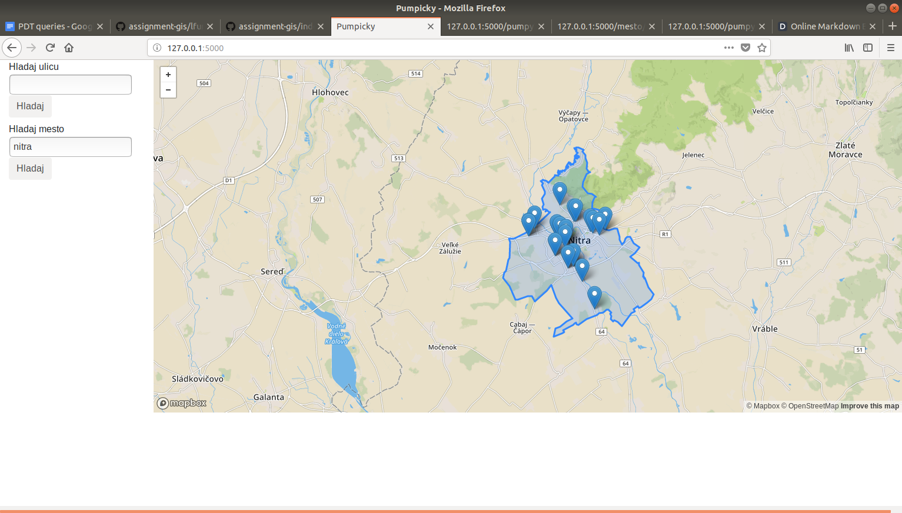

# Projekt Pumpičky

Projekt Pumpičky zobrazuje na mape prehľad čepracích staníc na území Slovenskej republiky podľa zadaných kritérií.
Kritéria je možné zadávať:
  - kliknutím na mape,
  - zadaním názvu ulice,
  - zadaním názvu mesta.

## Scenáre
 - Zobrazenie čerpacích staníc v okolí bodu. Po kliknutí na mapu sa zobrazia na mape čerpacie stanice v okolí zakliknutého bodu v okruhu 5 km. V prípade, že je mapa príliš oddialená, nastane nazoomovanie vybranej časti na mape z dôvodu väčšej prehľadnosti.
 - Zobrazenie čerpacích staníc v okolí konkrétnej cesty. Po zadaní názvu cesty a kliknutiu na tlačidlo Hľadať sa na mape zobrazia čerpacie stanice v okolí zadanej cesty v rozsahu do 1km. Následne sa mapa nazoomuje na zobrazené čerpacie stanice.
 - Zobrazenie čerpacích staníc v oblasti mesta. Po zadaní názvu mesta a kliknutiu na tlačidlo Hľadať sa na mape zobrazia črpacie stanice v oblasti zadaného mesta. Následne sa mapa nazoomuje na vyznačenú oblasť.

## Frontend
Aplikácia využíva statickú stránku HTML index.html. Používa MapBox widget na zobrazenie mapy a JQuery na komunikáciu cez REST API.

## Backend
Backend je napísaný vo Flask frameworku a používa dáta z PostGIS databázy.

## Príklad použitých query
Čerpacie stanice pri zadanom bode
```
SELECT osm_id, name, st_asgeojson(st_transform(way,4326)) FROM planet_osm_point WHERE ST_DWithin(way, st_transform( st_setsrid(st_makepoint({dlzka}, {sirka}), 4326), 3857), 5000) AND amenity = 'fuel';
```
Čerpacie stanice pri zadanej ceste ceste
```
SELECT osm_id, name, st_asgeojson(st_transform(way,4326)) FROM (WITH RECURSIVE streets AS ( SELECT osm_id, name, way FROM planet_osm_line  WHERE upper(name) = upper('{nazov}'))  SELECT DISTINCT ON (p.osm_id) p.osm_id, p.name, p.way,  trunc(st_distance(st_setsrid(p.way, 4326), st_setsrid(l.way, 4326))) AS distance FROM planet_osm_point p, streets l where p.amenity = 'fuel' AND ST_DWithin(st_setsrid(p.way, 4326), st_setsrid(l.way, 4326), 1000)) pumpy ORDER BY distance;
```
Čerpacie stancie v oblasti zadaného mesta
```
 SELECT DISTINCT point.name, st_asgeojson(st_transform(point.way,4326)), st_asgeojson(st_transform(pol.way,4326))  FROM planet_osm_polygon pol, planet_osm_point point WHERE upper(pol.name) = upper('{nazov}') and point.amenity = 'fuel' AND st_intersects(pol.way, point.way);
```

## Dáta v databáze
Dáta v databáze sú z portálu openstreetmap.org, naimportovaná oblasť Slovensko. Dáta sa nahádzajú v 3 tabuľkách, planet_osm_point, planet_osm_line a planet_osm_polygon.

## Indexy
Použité indexy:
```
create index indexik on planet_osm_line (name, osm_id);

create index indexik2 on planet_osm_point (name, osm_id);

create index indexik3 on planet_osm_point (osm_id, name, way);

create index indexik4 on planet_osm_polygon (upper(name));

create index indexik5 on planet_osm_point (amenity);
```


